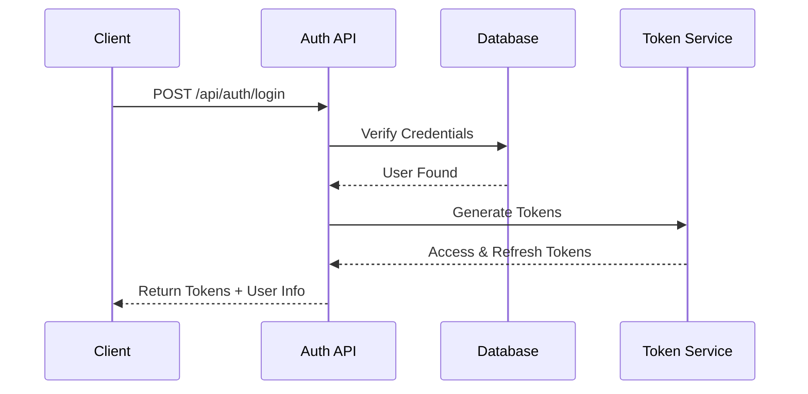
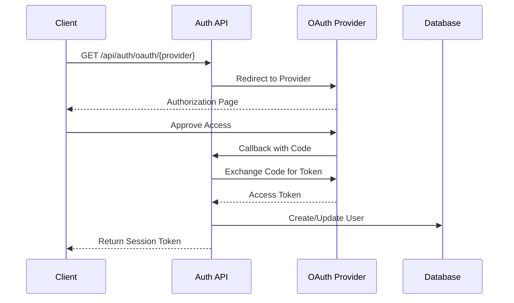
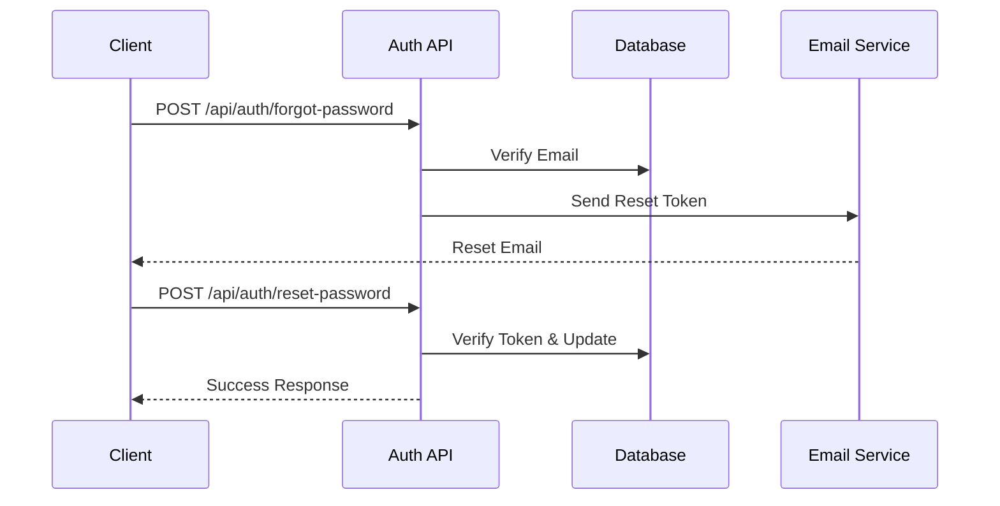
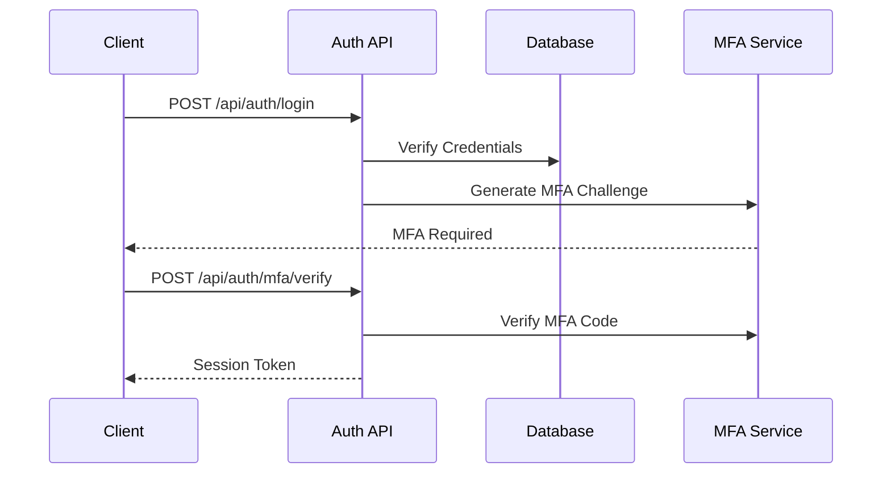
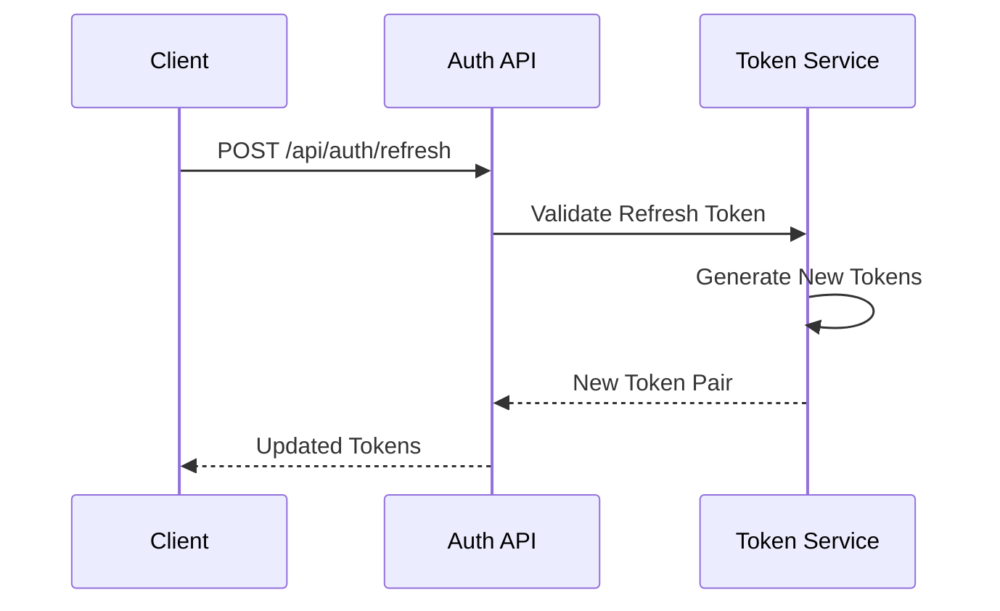
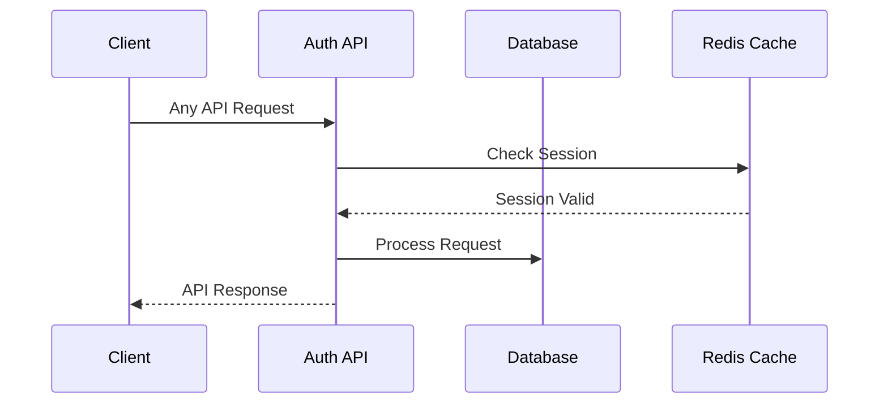

# Authentication Flows

This document outlines the authentication flows used in our API.

## Standard Login Flow



## OAuth2 Flow



## Password Reset Flow



## MFA Flow



## Token Refresh Flow



## Session Management



## Security Considerations

1. **Token Storage**
   - Access tokens stored in memory
   - Refresh tokens in secure HTTP-only cookies
   - Session IDs with appropriate security flags

2. **Token Expiration**
   - Access tokens: 15 minutes
   - Refresh tokens: 7 days
   - Reset tokens: 1 hour

3. **Rate Limiting**
   - Login attempts: 5 per minute
   - Password reset: 3 per hour
   - MFA attempts: 3 per 15 minutes

4. **Security Headers**
```http
Strict-Transport-Security: max-age=31536000; includeSubDomains
X-Frame-Options: DENY
X-Content-Type-Options: nosniff
X-XSS-Protection: 1; mode=block
``` 