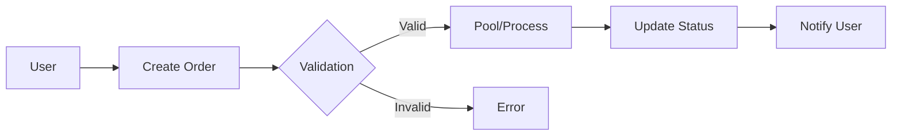
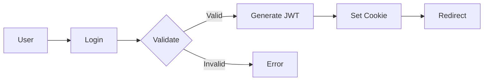

# Architecture Overview

## System Architecture

### High-Level Overview
The Bulk Buyer Group platform is built using a modern, scalable architecture with the following key components:

```
┌─────────────────┐     ┌─────────────────┐     ┌─────────────────┐
│   Next.js App   │────▶│   API Layer     │────▶│   Database      │
└─────────────────┘     └─────────────────┘     └─────────────────┘
        │                       │                        │
        │                       │                        │
        ▼                       ▼                        ▼
┌─────────────────┐     ┌─────────────────┐     ┌─────────────────┐
│   UI Components │     │ Business Logic  │     │   Data Models   │
└─────────────────┘     └─────────────────┘     └─────────────────┘
```

### Technology Stack
- **Frontend**: Next.js 13+ with App Router
- **Backend**: Node.js with Next.js API Routes
- **Database**: PostgreSQL with Prisma ORM
- **Authentication**: JWT with NextAuth.js
- **State Management**: React Context + SWR
- **UI Framework**: Tailwind CSS + Shadcn/ui
- **Testing**: Jest + React Testing Library
- **CI/CD**: GitHub Actions + Vercel

## Core Components

### Frontend Architecture
```
src/
├── app/                 # Next.js 13+ App Router
│   ├── api/            # API Routes
│   ├── auth/           # Authentication Pages
│   ├── dashboard/      # Dashboard Pages
│   └── orders/         # Order Management Pages
├── components/         # Reusable UI Components
│   ├── ui/            # Base UI Components
│   ├── forms/         # Form Components
│   └── layouts/       # Layout Components
├── lib/               # Utility Functions & Services
│   ├── services/      # Business Logic Services
│   ├── hooks/         # Custom React Hooks
│   └── utils/         # Helper Functions
└── types/             # TypeScript Type Definitions
```

### Backend Services
1. **Order Management Service**
   - Order Creation & Validation
   - Status Management
   - Order Pooling Logic
   - History Tracking

2. **User Management Service**
   - Authentication & Authorization
   - Role-based Access Control
   - User Profile Management

3. **Product Management Service**
   - Inventory Management
   - Product Catalog
   - Stock Level Tracking

4. **Dashboard Service**
   - Analytics & Reporting
   - Data Aggregation
   - Performance Metrics

5. **Crawler Service**
   - Web Scraping
   - Data Extraction
   - Price Monitoring

## Data Flow

### Order Processing Flow


### Authentication Flow


## Security

### Authentication & Authorization
- JWT-based authentication
- Role-based access control (RBAC)
- Session management
- Secure password hashing

### Data Security
- HTTPS encryption
- Input validation
- SQL injection prevention
- XSS protection

### API Security
- Rate limiting
- Request validation
- CORS configuration
- API key management

## Scalability

### Performance Optimizations
- Server-side rendering (SSR)
- Static site generation (SSG)
- API route caching
- Database query optimization

### Infrastructure
- Serverless deployment
- Auto-scaling configuration
- CDN integration
- Database replication

## Monitoring & Logging

### Application Monitoring
- Error tracking
- Performance metrics
- User analytics
- System health checks

### Logging System
- Request/response logging
- Error logging
- Audit trails
- Performance logging

## Development Workflow

### Version Control
- Feature branching
- Pull request reviews
- Semantic versioning
- Automated testing

### CI/CD Pipeline


### Testing Strategy
- Unit tests
- Integration tests
- E2E tests
- Performance tests

## Future Considerations

### Planned Improvements
- Microservices architecture
- Real-time updates
- Advanced analytics
- Mobile application

### Scalability Plans
- Geographic distribution
- Load balancing
- Caching strategies
- Database sharding

## Dependencies

### Core Dependencies
- Next.js
- React
- Prisma
- PostgreSQL
- TypeScript
- Tailwind CSS

### Development Dependencies
- ESLint
- Prettier
- Jest
- Testing Library
- Husky
- Lint-staged

## Environment Setup

### Development Environment
```env
NODE_ENV=development
DATABASE_URL=postgresql://...
NEXTAUTH_SECRET=...
NEXTAUTH_URL=http://localhost:3000
```

### Production Environment
```env
NODE_ENV=production
DATABASE_URL=postgresql://...
NEXTAUTH_SECRET=...
NEXTAUTH_URL=https://bulkbuyergroup.com
```

## Deployment

### Deployment Process
1. Code push to main branch
2. Automated tests run
3. Build process starts
4. Deploy to staging
5. Smoke tests
6. Deploy to production

### Infrastructure
- Vercel for hosting
- PostgreSQL on AWS RDS
- GitHub Actions for CI/CD
- CloudFlare for CDN 